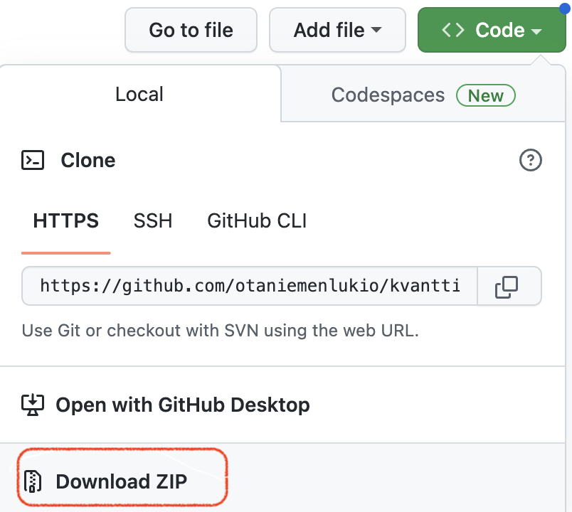

# Kierros 1 — Kvanttilaskennan lukiokurssi 2023

Kierros 1 alkaa ke 8.2.2023, loppuu ti 1.3.2023.
Mallivastaukset julkaistaan pe 10.2.2023.

## Työkirja

Älä lataa Jupyter notebook-työkirja tiedostoa suoraan, koska sen mukana ei tule ulkoisia resursseja, kuten kuvia.

Lataa sen sijaan koko git-repositorio zip-tiedostona klikkaamalla `Code` ja `Download ZIP`.

## Tehtävien palautus

Palauta muokattu `kierros1_kvanttilaskenta2023.ipynb` [Google Formsiin](TODO) viimeistään 1.3.2023 klo 16:15.

## Mallivastaukset

Mallivastauksia ei ole vielä julkaistu.

## Materiaalit

- Luentotallennus TODO
- TODO materiaalia
